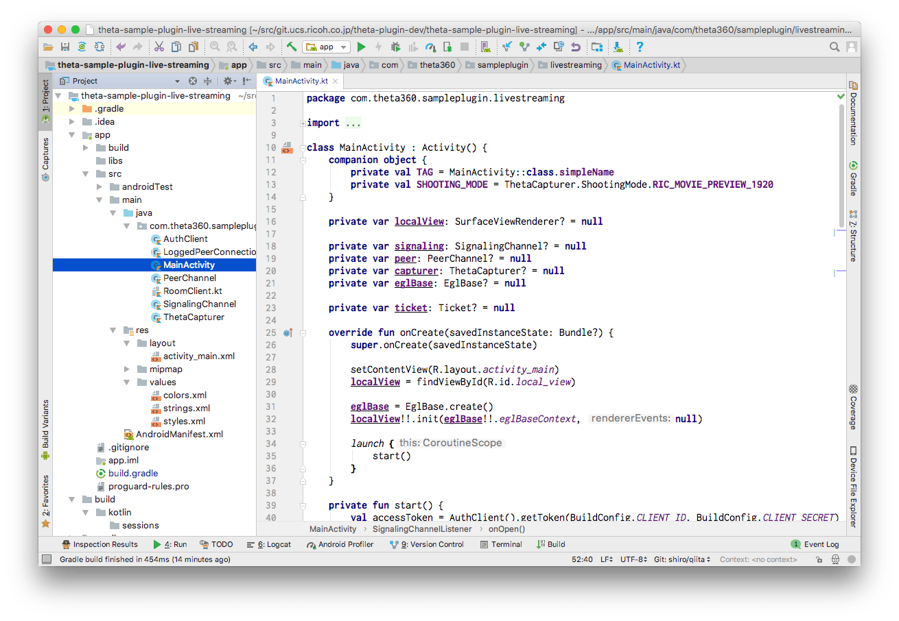
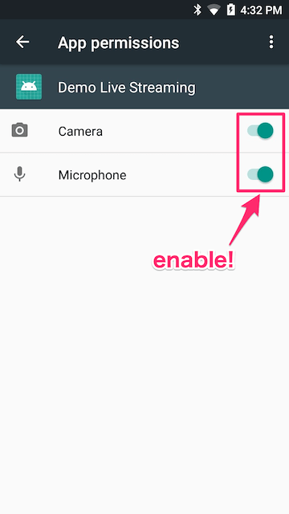

# RICOH Live Streaming plug-in Sample for RICOH THETA

A plug-in sample for RICOH THETA broadcasting 360 degree video via [RICOH Live Streaming API](https://api.ricoh/products/live-streaming-api/).

## Set up

Download this project using git clone.

```sh
$ git clone https://github.com/ricohapi/theta-plugin-ricoh-live-streaming-sample
```

Create `gradle.properties` on the project root and write the client credentials and the room ID.

```
client_id={your client ID}
client_secret={your client secret}
room_id={room ID to join}
```

Import this project by Android Studio.



Build the plug-in and install to the THETA.

## Usage

You need set up app permissions manually after the instllation.



After setting up the permission, just launch the plug-in. The plug-in connect to the room configured by `gradle.properties` and broadcast 360 degree video.

## License

```plain
Copyright 2018 Ricoh Company, Ltd.

Licensed under the Apache License, Version 2.0 (the "License");
you may not use this file except in compliance with the License.
You may obtain a copy of the License at

    http://www.apache.org/licenses/LICENSE-2.0

Unless required by applicable law or agreed to in writing, software
distributed under the License is distributed on an "AS IS" BASIS,
WITHOUT WARRANTIES OR CONDITIONS OF ANY KIND, either express or implied.
See the License for the specific language governing permissions and
limitations under the License.
```
